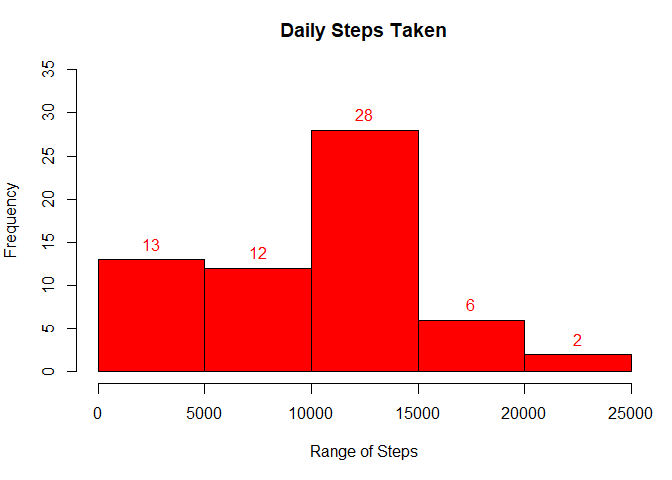
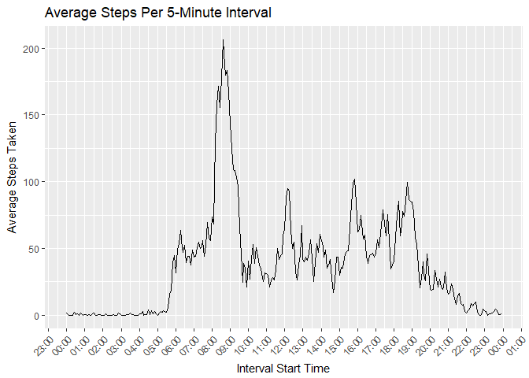
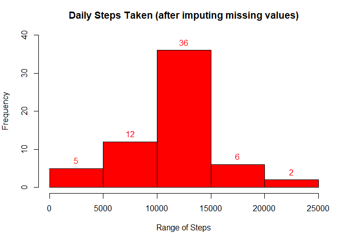

# Reproducible Research: Peer Assessment 1


## Loading and preprocessing the data

```r
library(lubridate)
library(ggplot2)
if (!file.exists("activity.zip")) stop("Must have activity.zip in WD")
act<- read.csv(unz("activity.zip", "activity.csv"), stringsAsFactors=FALSE)
# Add a POSIXlt datetime column using date and interval columns (lubridate)
act$datetime <- ymd(act$date) + hm(act$interval/100)
```


## Step 1 - Steps Per Day

Objectives of the first step are to - 

1. Plot a histogram of steps taken per day 
2. find the mean and median steps per day


```r
# Summarize steps per day
dailySummary <- tapply(act$steps, act$date, function(x) sum(x, na.rm=TRUE))
# Plot a base histogram and save calculated x and y coordinates
par(mar=c(5,4,3,1))
coords<-hist(dailySummary,
		  main="Daily Steps Taken", 
		  xlab="Range of Steps", ylab="Frequency", col="red", ylim=c(0,35)
) 
# Add value labels to bars above the bar (pos=3)
text(coords$mids, y=coords$counts,labels=coords$counts, pos=3, col="red")
```

<!-- -->

```r
# Show mean and median daily steps
sprintf("Mean Daily Steps:   %.2f", mean(dailySummary))
sprintf("Median Daily Steps: %.2f", median(dailySummary))
```

```
## [1] "Mean Daily Steps:   9354.23"
## [1] "Median Daily Steps: 10395.00"
```


### Step 2 - Daily Activity Pattern 

Objectives of the second step are to -   
1. Plot average steps per 5-minute interval across all dates in the data 
2. Find the 5-minute interval with the highest average number of steps 

```r
# Summarize steps by interval across all days 
IntervalMeans <- tapply(act$steps, act$interval, function(x) mean(x, na.rm=TRUE))

# generate datetime series using today's date and the interval label from summary
timeSer <- today()+hm(sprintf("%05.2f", as.numeric(names(IntervalMeans))/100))
# make a data frame for ggplot
df<- data.frame(Interval = timeSer, Average_Steps = IntervalMeans)
ggplot(df, aes(Interval, Average_Steps)) + 
	geom_line() +
	scale_x_datetime(date_breaks="1 hour", date_labels="%H:%M") +
	labs(title="Average Steps Per 5-Minute Interval") + 
	labs(x="Interval Start Time", y="Average Steps Taken") +
	theme(axis.text.x=element_text(angle = 45, hjust=1))
```

<!-- -->

```r
maxInterval <- which.max(df$Average_Steps)
paste0("Highest average steps (", 
	   round(df$Average_Steps[maxInterval], 2),
	   ") Occur in the 5-minute interval ending at ", 
	   format(timeSer[maxInterval], "%H:%M")
)
```

```
## [1] "Highest average steps (206.17) Occur in the 5-minute interval ending at 08:35"
```


## Step 3 - Imputing missing values
First check summary of the original data to see which columns contain NAs.

```r
summary(act)
```

```
##      steps            date              interval     
##  Min.   :  0.00   Length:17568       Min.   :   0.0  
##  1st Qu.:  0.00   Class :character   1st Qu.: 588.8  
##  Median :  0.00   Mode  :character   Median :1177.5  
##  Mean   : 37.38                      Mean   :1177.5  
##  3rd Qu.: 12.00                      3rd Qu.:1766.2  
##  Max.   :806.00                      Max.   :2355.0  
##  NA's   :2304                                        
##     datetime                  
##  Min.   :2012-10-01 00:00:00  
##  1st Qu.:2012-10-16 05:58:45  
##  Median :2012-10-31 11:57:30  
##  Mean   :2012-10-31 11:57:30  
##  3rd Qu.:2012-11-15 17:56:15  
##  Max.   :2012-11-30 23:55:00  
## 
```

This shows us that only the steps column has nulls so we need to focus on this only.

Next, see show how many rows contain NAs - 

```r
numNA <- sum(is.na(act$steps))
sprintf("%s %d %s", "There are", numNA, "NA values in the data.")
```

```
## [1] "There are 2304 NA values in the data."
```

Next, let's see if there are any instances where the steps column has both NA and Non-NA steps for a particular date.

```r
t<-table(act$date, ifelse(is.na(act$steps), "NAs", "nonNAs"))
any(t[,"NAs"] > 0 & t[,"nonNAs"] > 0)
```

```
## [1] FALSE
```
Since the above returns FALSE, we know that there are no dates on which some intervals have NA steps and some have valid values. In other words, we either have NA steps for all intervals on a date, or the date has no NAs.

To fill in the missing values, let's replace all the steps all dates with NA with  the mean values for each interval from the interval means we already calculated in step 2.

Note that it is possible that the activity pattern significantly differs by day-of-week or by workday v/s weekend day.  If so, it would make more sense to replace NAs with the average for that weekday.  However, weekday-wise summary is the next step of the exercise, so let's take a above route and use what we have already in this analysis.


```r
act2 <- act
# see how many unique dates have all-NA steps 
CountDatesWithNA <- length(unique(act2$date[is.na(act2$steps)])) 
# Replace all NA steps with the IntervalMeans interval means calculated in step 1
act2$steps[is.na(act2$steps)] <- rep(IntervalMeans, times=CountDatesWithNA)
```

Now reproduce the histogram from step 1 and recalculate the mean and median.


```r
# Summarize steps per day
dailySummary2 <- tapply(act2$steps, act2$date, sum)
# Plot a base histogram and save calculated x and y coordinates
par(mar=c(5,4,3,1))
coords<-hist(dailySummary2,
			 main="Daily Steps Taken (after imputing missing values)", 
			 xlab="Range of Steps", ylab="Frequency", col="red",
			 ylim=c(0,40)
) 
# Add value labels to bars above the bar (pos=3)
text(coords$mids, y=coords$counts,labels=coords$counts, pos=3, col="red")
```

<!-- -->

```r
# Show mean and median daily steps
sprintf("Mean Daily Steps After Imputing NAs:   %.2f", mean(dailySummary2))
sprintf("Median Daily Steps After Imputing NAs: %.2f", median(dailySummary2))
```

```
## [1] "Mean Daily Steps After Imputing NAs:   10766.19"
## [1] "Median Daily Steps After Imputing NAs: 10766.19"
```

### As a result of imputing the NA values, mean daily steps went up from 9,354.23 to 10,766.19.  The median also went up and median is now the same as mean.


## Step 4 - Weekday patterns

Objective is to see if there are differences in activity patterns between weekdays and weekends.


```r
# add a factored day column for weekend/weekday
weekendDays <- c('Saturday', 'Sunday')
act2$day <- ifelse(weekdays(ymd(act2$date), FALSE) %in% weekendDays, "Weekend", "Weekday") 
act2$day<-as.factor(act2$day)
act2$prettyInterval <- today()+hm(sprintf("%05.2f", act2$interval/100))
ggplot(act2, aes(prettyInterval, steps)) +
	facet_grid(day~.) +
	stat_summary(fun.y = "mean", colour = "blue", geom = "line") +
	scale_x_datetime(date_breaks="1 hour", date_labels="%H:%M") +
	labs(title="Average Steps Per 5-Minute Interval") + 
	labs(x="Interval Start Time", y="Average Steps Taken") +
	theme(axis.text.x=element_text(angle = 45, hjust=1))
```

<!-- -->


